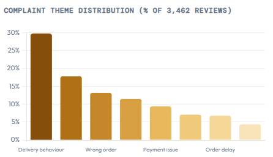
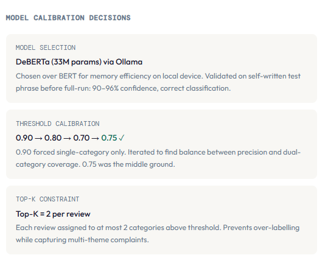

# Zomato — Complaint & Refund Resolution Case Study

## Problem Statement

Food delivery complaints often look noisy when viewed one by one, but repeated patterns can reveal process failures that product, support, and operations teams need to solve together. This project was built to identify those patterns from review data and convert them into structured business requirements.

***

## Objective

To analyse complaint reviews, identify the most common failure themes, detect whether spikes point to broader operational breakdowns, and translate the findings into a BRD-style output that a business or product team could act on.

***

## Dataset and Scope

| Field | Value |
|---|---|
| Complaint reviews analysed | 3,462 |
| Theme count | 10 |
| Output type | Complaint analysis + BRD-style recommendations |

The analysis focused on customer complaints, refund experience, support response, and delivery-related issues.

***

## What This Project Does

### 1. Complaint theme classification
Used zero-shot NLP to group complaint reviews into 10 major themes. This made it possible to move from individual complaints to category-level insight.

### 2. Pattern detection
Checked where complaint volume concentrated over time and across issue types. The data showed that some spikes were not isolated incidents but signals of broader operational failure.

### 3. Business translation
Converted analytical findings into a BRD-style structure with:
- problem statement,
- affected flows,
- failure areas,
- owner-team mapping,
- and functional recommendations.

***

## Key Findings

- Delivery behaviour and no-support-response emerged as two of the most serious complaint areas.
- Complaint spikes on specific dates suggested system-wide breakdowns rather than random individual dissatisfaction.
- The problem required cross-functional action involving delivery operations, customer support, and platform workflows.
- The final output was not just analysis; it was a requirements-oriented business case.

***

## Final Output

The project translated the review analysis into a BRD-style recommendation set with **9 functional requirements** mapped to likely owner teams.

That makes the repository especially relevant for:
- Business Analyst roles,
- Product Analyst roles,
- customer experience / operations analysis,
- and data-to-decision storytelling.

***

## Tech Stack

- Python
- zero-shot NLP
- SQL
- Power BI
- business documentation

***

## Why It Matters

This project shows how complaint data can be used for more than reporting. It can support root-cause thinking, prioritisation, and requirement definition. That makes it useful at the intersection of analytics, operations, and product improvement.

***

Independent project built to demonstrate complaint analytics, business problem framing, and BRD-oriented thinking.
